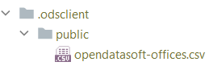

# odsclient

*A nonofficial client for OpenDataSoft API.*

[](https://pypi.python.org/pypi/odsclient/) [](https://travis-ci.com/smarie/python-odsclient) [](https://smarie.github.io/python-odsclient/junit/report.html) [](https://codecov.io/gh/smarie/python-odsclient)

[](https://smarie.github.io/python-odsclient/) [](https://pypi.python.org/pypi/odsclient/) [](https://pepy.tech/project/odsclient) [](https://pepy.tech/project/odsclient) [](https://github.com/smarie/python-odsclient/stargazers)

!!! success "New: you can now use a local file cache ! Check it out [below](#a-caching)."

!!! success "New: stream-download huge datasets to csv files directly, and use `tqdm` progress bars !"

`odsclient` provides a minimal set of functions to grab a dataset or a collection of datasets from an OpenDataSoft (ODS) platform. 

Its initial purpose is not to cover the [full set of APIs available](https://help.opendatasoft.com/en/apis/) but to get a minimum viable set of features to work easily with the datasets.

## Installing

```bash
> pip install odsclient
```

Optional:

 - If you wish to display progress bars, you should also install `tqdm`.
 - If you wish to download datasets as dataframes, you should also install `pandas`. 

Finally, if you plan to use api keys, we recommend that you install `keyring` as it will help you store the critical api keys in your operating system's password vault.

```bash
> pip install keyring
```

## Usage

### 1. Basics

#### a- Downloading a "flat" dataset

The most basic thing that you can do is to download a whole dataset, similarly to what you can get when clicking on the links with your browser on a dataset's ["Export" page](https://public.opendatasoft.com/explore/dataset/opendatasoft-offices/export/):

```python
from odsclient import get_whole_dataset

dataset_id = "respect-des-delais-dacheminement-courrier"
csv_str = get_whole_dataset(dataset_id, platform_id='public')

print(csv_str)
```

yields

```
Catégorie;Objectif ou Réalisation;Pourcentage;Annee
Lettre prioritaire J + 1;objectif;0.84;2009
Lettre recommandée J + 2;réalisation;0.9460000000000001;2014
Courrier industriel J + 2;objectif;0.9500000000000001;2009
Colissimo guichet J + 2;réalisation;0.877;2009
...
```

In addition:

 - you might wish to display a progress bar using `tqdm=True` (`pip install tqdm` first). Note that on some ODS platforms the HTTP Header `Content-Length` is not set, so you might only see a download rate, not an actual progress bar.

 - you might wish to download directly the dataset to a csv using streaming and without loading it in memory. This can be achieved by setting `to_path=<path>` where the path can be a string or a `pathlib.Path` instance.

Finally, if you have `pandas` installed, you can get the dataset directly as a dataframe:

```python
from odsclient import get_whole_dataframe

dataset_id = "respect-des-delais-dacheminement-courrier"
df = get_whole_dataframe(dataset_id, platform_id='public')

print(df.head())
```

yields

```
                   Catégorie Objectif ou Réalisation  Pourcentage  Annee
0   Lettre prioritaire J + 1                objectif        0.840   2009
1   Lettre recommandée J + 2             réalisation        0.946   2014
2  Courrier industriel J + 2                objectif        0.950   2009
3    Colissimo guichet J + 2             réalisation        0.877   2009
4         Lettre verte J + 2             réalisation        0.932   2014
```

#### b- Using another ODS platform

By default the base url used to access the OpenDataSoft platform is `https://<platform_id>.opendatasoft.com`, with `platform_id='public'`. In the methods above, you can change either the platform id with `platform_id=...` if your target ODS platform has a standard host name, or the entire base url with `base_url=...`.

If you wish to check the result without executing the method, you can create an `ODSClient` object with the same parameters and inspect its `<client>.base_url` :

```python
from odsclient import ODSClient

default_client = ODSClient()
print("Default:               %s" % default_client.base_url)

client_with_custom_pfid = ODSClient(platform_id='my_ods')
print("Custom `platform_id`:  %s" % client_with_custom_pfid.base_url)

client_with_custom_baseurl = ODSClient(base_url="https://my_ods_server.com/")
print("Custom `base_url`:     %s" % client_with_custom_baseurl.base_url)
```

yields

```
Default:               https://public.opendatasoft.com
Custom `platform_id`:  https://my_ods.opendatasoft.com
Custom `base_url`:     https://my_ods_server.com
```

Note that any trailing slash is automatically removed from custom base urls.

#### c- Declaring an API key

Most ODS servers require some sort of authentication to access some of their contents. `odsclient` supports authentication through API keys (see [ODS API Documentation](https://help.opendatasoft.com/en/apis/)). There are several ways that you can use to specify an api key to use for your ODS interactions.

##### explicit, temporary

If your need is a "quick and dirty" test, you can use direct `apikey=...` argument passing. This is the **most insecure** way of all, since your code will contain the key as a readable string. It should only be used as a temporary workaround, and should never be committed with the source code.
 
```python 
csv_str = get_whole_dataset("world-growth-since-the-industrial-revolution0", 
                            apikey="my_non_working_api_key")
```

##### interactive

If your application tolerates user interaction through the terminal, you can make the above more secure by using [`getpass()`](https://docs.python.org/3/library/getpass.html) so that users are prompted for the api key at runtime:
 
```python
from getpass import getpass
csv_str = get_whole_dataset("world-growth-since-the-industrial-revolution0", 
                            apikey=getpass())
```

##### permanent

In all other cases, we recommend that you write apikey-agnostic code such as the one below:

```python
csv_str = get_whole_dataset("world-growth-since-the-industrial-revolution0")
```

In that case, `odsclient` will try several strategies to find an api key:

 - first it will look for an `ods.apikey` text file containing the api key. The file should obviously not be committed with the source code (use `.gitignore` !). This is not the most secure solution, as malicious programs on your computer may have access to the file, and moreover you may commit it by accident (human error prone). You can override the default file path with the `apikey_filepath=...` argument.

 - then if `keyring` is installed (`pip install keyring`), it will check if there is an entry in it for service `<base_url>` and username `'apikey_user'`. `keyring` leverages your OS' vault ([Windows Credential Locker, macOS Keychain, Ubuntu SecretService, GNOME Keyring, etc.](https://keyring.readthedocs.io/en/latest/?badge=latest#what-is-python-keyring-lib)). **This is the most secure method available, it is therefore highly recommended**. You can override the default keyring entry username with the `keyring_entries_username=...` argument. You can easily add or remove an entry in the keyring with the [`odskeys` commandline utility](./odskey.md), through the OS interface, or with the `store_apikey_in_keyring` / `get_apikey_from_keyring` / `remove_apikey_from_keyring` python API provided in `odsclient`.
  
 - finally it looks for an `ODS_APIKEY` OS environment variable. This environment variable should either contain a single api key without quotes (e.g. `aef46reohln48`), or a dict-like structure where keys can either be `<platform_id>`, `<base_url>`, or the special fallback key `'default'` (e.g. `{'public': 'key2', 'https://myods.com': 'key3', 'default': 'key1'}`). This method is not the most secure solution because malicious programs can access the OS environment variables ; however it should be preferred over the file-based method as it is not human error-prone. Besides it can be handy for continuous integration jobs.

If you wish to **force** usage of an api key (and prevent any ODS query to be made if none is found), you may wish to set `enforce_apikey=True`:

```python
csv_str = get_whole_dataset("world-growth-since-the-industrial-revolution0",
                            enforce_apikey=True  # raise if no apikey is found
                            )
```

If no api key is found, the above yields:

```
odsclient.core.NoODSAPIKeyFoundError: ODS API key file not found, while it is 
    marked as mandatory for this call (`enforce_apikey=True`). It should either 
    be put in a text file at path 'ods.apikey', or in the `ODS_APIKEY` OS 
    environment variable, or (recommended, most secure) in the local `keyring`.
    See documentation for details: 
    https://smarie.github.io/python-odsclient/#c-declaring-an-api-key. 
    Note that you can generate an API key on this web page: [...].
```

This can be handy if you wish your users to see a quick help at first call reminding them on the various ways to provide an api key.

Finally, for debugging purposes, you may wish to use `get_apikey()` to check if the api key that is actually used is the one you think you have configured (through a file, env variable, or keyring):

```python
from odsclient import get_apikey
print("api key used: %s" % get_apikey(base_url="https://my_ods_server.com/"))
```

#### d- Pushing a dataset (Realtime API)

Pushing new data to the _Realtime_ API of ODS works through the `push_dataset_realtime` function.
In order to push data you need to get a pushkey for your dataset at the _Sources_ tab
on the dataset definition page in order to get this work.

!!! warning "The pushkey is independent from your API key. Passing your API key as the pushkey won't work."

You can push the data as CSV or as a `pandas` dataframe, as shown below.

##### Pushing a CSV

The simplest way to push a dataset is to provide a string following the CSV format:

```python
from odsclient import ODSClient

o = ODSClient('<<ODS-platform-id>>')

csv = """column_1,column_2
1,2
3,4
"""

res = o.push_dataset_realtime('<<dataset-id>>',
                              csv,
                              format='csv',
                              csv_separator=',',
                              push_key='<<your-push-key>>')
```

##### Pushing a DataFrame

If you have `pandas` installed you can also push a `DataFrame` directly:

```python
import pandas as pd
from odsclient import ODSClient

o = ODSClient('<<ODS-platform-id>>')

dataset = [
    {'a': 1, 'b': 2},
    {'a': 3, 'b': 4},
]
p_df = pd.DataFrame(dataset)

res = o.push_dataset_realtime("<<dataset-id>>",
                              p_df,
                              format='pandas',
                              push_key='<<your-push-key>>')
```

See [API reference](api_reference.md) for details.


### 2. Advanced

#### a. Caching

If you use some datasets often, you might not wish to make a query to the ODS platform everytime your code runs. To avoid useless calls, you can now use the `file_cache` argument, in any of the dataset retrieval methods. It can either receive a path-like object indicating the folder to use as the cache root, or a boolean (`True` means `.odsclient/`, `False` means cache disabled).

```python
csv_str = get_whole_dataset("opendatasoft-offices", file_cache=True)
```

You should see the following file created:



The next usage of this dataset (through `get_whole_dataset` or through `get_whole_dataframe`) will not make a network call and will instead reuse this local file.

In addition you have access to two utility methods : 

 - `clean_cache` cleans parts or all of the cache. Note that this is equivalent to removing the folders/files by hand, so you can do this too.
   
 - `get_cached_dataset_entry` or `<ODSClient>.get_cached_dataset_entry` returns a `CacheEntry` object representing the cached file. This object contains its path and provides handy methods to read and write the file.

!!! note "All files in the cache are converted to `utf-8` encoding"
    In order to avoid storing encoding information in the cache folder, `odsclient` converts all downloaded datasets to `utf-8` encoding before storing them in the cache. This should have no side-effect for you except if you try to read the cached file directly without using the `CacheEntry.read()` method, or if your dataset contains [old/alternative forms of east asian kanji](https://en.wikipedia.org/wiki/Unicode#Issues) that cannot be represented with unicode encodings.


## Main features / benefits

 - Simple access to ODS API to retrive a whole dataset as text (csv) or dataframe
   
 - Support for many methods to define an api key, independently of the source code: different users may use different methods (env variable, api key file, keyring) while using the same odsclient code.
   
 - Easy-to-use caching capabilities on the local disk.

## See Also

This library was inspired by:

 * [`azmlclient`](https://smarie.github.io/python-azureml-client/)
 * [`keyring`](https://pypi.org/project/keyring/)
 * Work in progress: using KeePass as a `keyring` backend. [Here](https://github.com/brettviren/python-keepass) and [here](https://github.com/jaraco/keyring/issues/14)

### Others

*Do you like this library ? You might also like [my other python libraries](https://github.com/smarie/OVERVIEW#python)* 

## Want to contribute ?

Details on the github page: [https://github.com/smarie/python-odsclient](https://github.com/smarie/python-odsclient)
