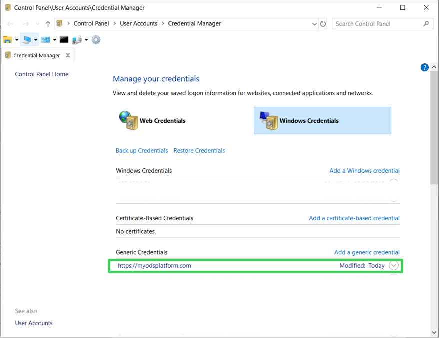
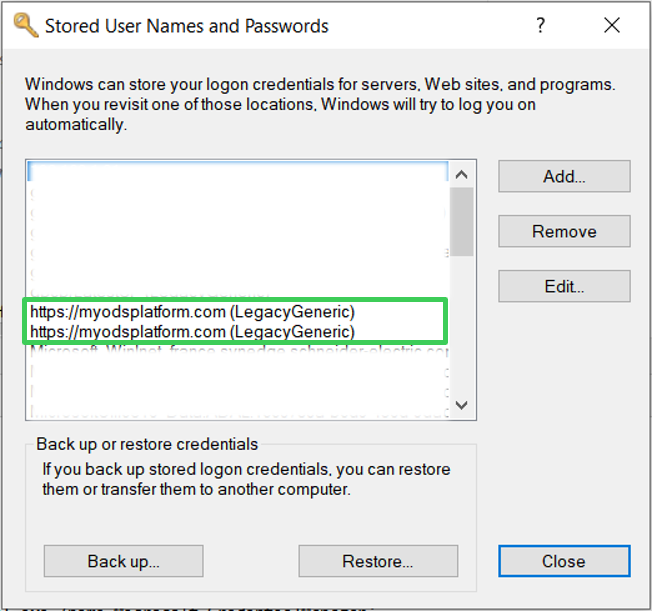

# `odskey` commandline utility

Registering an api key in your OS' vault should not be a pain. 

Although `keyring` comes with a handy [commandline utility](https://github.com/jaraco/keyring/#command-line-utility) already, since in `odsclient` we use a specific hardcoded pattern (`service_name=<base_url>, username='apikey_user', password=<apikey>`), we provide an even easier commandline for you named `odskey`:

## Usage

```
Usage: odskeys [OPTIONS] COMMAND [ARGS]...

  Commandline utility to get/set/remove api keys from the OS keyring using
  the `keyring` library. To get help on each command use:

      odskeys <cmd> --help

Options:
  --help  Show this message and exit.

Commands:
  get     Looks up an ODS apikey entry in the keyring.
  remove  Removes an ODS apikey entry from the keyring.
  set     Creates an ODS apikey entry in the keyring.
  show    Shows the OS credentials manager associated with current keyring...
```

For example:

```
>>> odskeys get -b https://myodsplatform.com/
No api key registered for platform url 'https://myodsplatform.com/'

>>> odskeys set -b https://myodsplatform.com/
Please enter your api key: ...

>>> odskeys get -b https://myodsplatform.com/
Api key found for platform url 'https://myodsplatform.com/': ...

>>> odskey remove -b https://myodsplatform.com/
Api key removed successfully for platform url 'https://myodsplatform.com/'
```

## Optional management gui

For some `keyring` backends there is an OS graphical user interface available, where you can see the inserted credentials. `odskeys show` opens this GUI if available.

This section is work in progress - if your system configuration is not supported do not hesitate to open a [ticket](https://github.com/smarie/python-odsclient/issues) ! 

### Windows - Credentials Manager

On Windows (tested on windows 10), `odskeys show` yields the configuration panel management interface:


 
`odskeys show --alt 1` yields the alternate legacy interface:



### MacOS - Keychain

**TODO - contributions appreciated**

### Linux Ubuntu - SecretService

**TODO - contributions appreciated**
